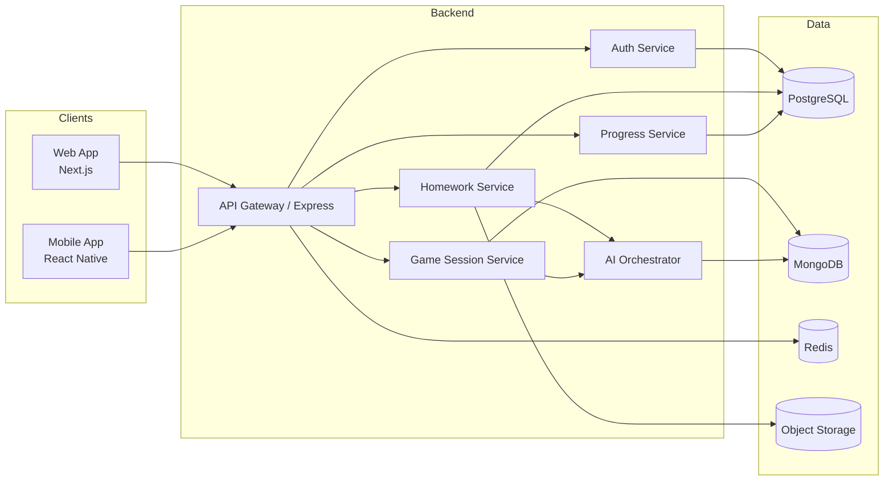

# Homework Suite Architecture (Proposed)

## 1. High-Level System Design

## 2. Service Responsibilities
- **API Layer**: routing, auth middleware, rate limiting, request validation.
- **Auth Service**: identity federation, JWT/session issuance, parental consent status.
- **Homework Service**: intake, storage metadata, parsing lifecycle.
- **AI Orchestrator**: OCR/NLP adapters, subject classification, content normalization.
- **Game Session Service**: game state transitions, scoring, streaks, reward unlocks.
- **Progress Service**: mastery model updates, dashboards, reporting exports.

## 3. Data Strategy
- **PostgreSQL**
  - users, classrooms, assignments, mastery snapshots, achievements.
- **MongoDB**
  - dynamic game session documents and generated content variants.
- **Redis**
  - leaderboard cache, active session acceleration, idempotency and rate limits.
- **Object Storage (S3/GCS)**
  - uploaded homework files and derived artifacts.

## 4. Event-Driven Flow (Recommended)
1. Homework uploaded → persisted in storage + metadata in PostgreSQL.
2. Parse request enqueued.
3. AI orchestrator processes OCR/NLP and emits parsed homework event.
4. Game generator creates challenge packets and saves to MongoDB.
5. Client requests game session and starts interactive loop.
6. Answer submissions update rewards and mastery metrics.

## 5. Security Baseline
- JWT access + refresh token rotation.
- RBAC for student/teacher/parent/admin roles.
- Input validation with strict schema checks.
- Signed URL upload/download for media.
- PII encryption and audit logging for sensitive actions.

## 6. Scalability Notes
- Stateless API pods behind load balancer.
- Queue-backed AI processing for burst traffic.
- Caching leaderboards and hot assignment views.
- Partitioning strategy for tenant/school boundaries.

## 7. Observability
- Structured logs with correlation IDs.
- Metrics: p95 latency, parse success rate, session completion funnel.
- Tracing across API → AI → data stores.
- Alerting on OCR failure rate spikes and auth anomalies.
